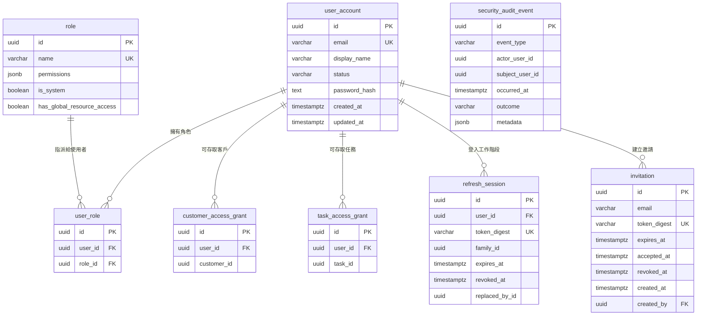

# Access Control 資料庫結構

本文描述 SEO 後台 Access Control 使用的 PostgreSQL 資料庫結構。

- 資料庫：`access_control`
- Schema：`public`
- Schema 來源：`deploy/local/postgresql/001_access_control_schema.sql`
- 核對環境：PostgreSQL 18.4
- 核對日期：2026-06-11

## 資料表總覽

| 資料表 | 用途 | 目前程式支援 |
|---|---|---|
| `user_account` | 後台使用者帳號、登入狀態及密碼雜湊 | 已使用 |
| `role` | 角色、功能權限及全域資料權限 | 已使用 |
| `user_role` | 使用者與角色的多對多關聯 | 已使用 |
| `customer_access_grant` | 指派使用者可以存取的客戶 | 已使用 |
| `task_access_grant` | 指派使用者可以單獨存取的任務 | 已使用 |
| `refresh_session` | Refresh Token rotation、撤銷及多裝置工作階段 | 已使用 |
| `invitation` | 邀請新使用者建立帳號 | 已使用 |
| `security_audit_event` | 未來記錄登入、權限異動與安全事件 | 已建表，尚未接入程式 |
| `department` | 員工部門主檔 | 已使用 |
| `password_reset` | 一次性密碼重設 Token digest | 已使用 |
| `notification_outbox` | 加密的待寄通知 | 已使用，尚未串接寄信 provider |

## 關聯圖



## `user_account`

儲存可以登入 SEO 後台的使用者帳號。角色與資料範圍不直接放在本表，而是透過關聯表管理。

| 欄位 | PostgreSQL 型別 | 必填 | 限制／預設值 | 用途 |
|---|---|---:|---|---|
| `id` | `uuid` | 是 | Primary Key | 使用者唯一識別碼，也是授權判斷的 `userId`。 |
| `email` | `varchar(320)` | 是 | Unique | 登入帳號。Application 會先去除前後空白並轉為小寫。 |
| `display_name` | `varchar(200)` | 是 |  | 後台顯示名稱。 |
| `status` | `varchar(32)` | 是 |  | 帳號狀態。目前 Domain 支援 `invited`、`active`、`disabled`。只有 `active` 可以登入及取得權限。 |
| `password_hash` | `text` | 否 |  | Argon2id 密碼雜湊。不可存放明文密碼；未設定時無法使用密碼登入。 |
| `created_at` | `timestamptz` | 是 |  | 帳號建立時間。 |
| `updated_at` | `timestamptz` | 是 |  | 帳號最後更新時間。 |

### 限制與索引

- Primary Key：`user_account_pkey (id)`
- Unique：`user_account_email_key (email)`
- 刪除使用者時，相關的 `user_role`、`customer_access_grant`、`task_access_grant` 與 `refresh_session` 會由資料庫級聯刪除。

## `role`

定義 RBAC 角色及角色擁有的功能權限。

| 欄位 | PostgreSQL 型別 | 必填 | 限制／預設值 | 用途 |
|---|---|---:|---|---|
| `id` | `uuid` | 是 | Primary Key | 角色唯一識別碼。 |
| `name` | `varchar(100)` | 是 | Unique | 角色名稱，例如 `admin`、`seo-specialist`。Application 以不區分大小寫方式檢查名稱重複。 |
| `permissions` | `jsonb` | 是 | 預設 `[]` | 功能權限字串陣列，例如 `customers.read`、`tasks.update`。使用者有效權限為所有角色權限的聯集。 |
| `is_system` | `boolean` | 是 | 預設 `false` | 是否為系統內建角色。目前主要供前端識別，尚未限制系統角色不可刪除或更名。 |
| `has_global_resource_access` | `boolean` | 是 | 預設 `false` | 是否可以忽略客戶與任務 Grant，存取全部資料範圍。 |

### 限制與索引

- Primary Key：`role_pkey (id)`
- Unique：`role_name_key (name)`
- 已被 `user_role` 使用的角色不能直接刪除，外鍵使用 `ON DELETE RESTRICT`。
- `permissions` 目前由 Application 驗證是否屬於程式定義的權限 allowlist；資料庫本身沒有 JSON schema constraint。

## `user_role`

使用者與角色的多對多關聯表。一位使用者可擁有多個角色，同一角色也可指派給多位使用者。

| 欄位 | PostgreSQL 型別 | 必填 | 限制／預設值 | 用途 |
|---|---|---:|---|---|
| `id` | `uuid` | 是 | Primary Key | 關聯資料唯一識別碼。 |
| `user_id` | `uuid` | 是 | FK → `user_account.id` | 被指派角色的使用者。 |
| `role_id` | `uuid` | 是 | FK → `role.id` | 指派的角色。 |

### 限制與索引

- Primary Key：`user_role_pkey (id)`
- Unique：`ux_user_role (user_id, role_id)`，避免同一角色重複指派。
- 刪除使用者：關聯資料會 `CASCADE` 刪除。
- 刪除角色：存在關聯時會 `RESTRICT` 拒絕刪除。

## `customer_access_grant`

記錄非全域使用者可以存取的客戶。使用者取得某客戶 Grant 後，也可以存取隸屬於該客戶的任務，前提是同時具有對應的功能權限。

| 欄位 | PostgreSQL 型別 | 必填 | 限制／預設值 | 用途 |
|---|---|---:|---|---|
| `id` | `uuid` | 是 | Primary Key | Grant 唯一識別碼。 |
| `user_id` | `uuid` | 是 | FK → `user_account.id` | 被授權的使用者。 |
| `customer_id` | `uuid` | 是 |  | 外部客戶資料的識別碼。 |

### 限制與索引

- Primary Key：`customer_access_grant_pkey (id)`
- Unique：`ux_user_customer_grant (user_id, customer_id)`
- 刪除使用者：Grant 會 `CASCADE` 刪除。
- `customer_id` 沒有資料庫外鍵，因為 Access Control DB 不擁有客戶主資料；由客戶 API 或其他 bounded context 管理。

## `task_access_grant`

記錄使用者可以單獨存取的任務。Task Grant 不會自動讓使用者看到同一客戶的其他任務。

| 欄位 | PostgreSQL 型別 | 必填 | 限制／預設值 | 用途 |
|---|---|---:|---|---|
| `id` | `uuid` | 是 | Primary Key | Grant 唯一識別碼。 |
| `user_id` | `uuid` | 是 | FK → `user_account.id` | 被授權的使用者。 |
| `task_id` | `uuid` | 是 |  | 外部 SEO 任務資料的識別碼。 |

### 限制與索引

- Primary Key：`task_access_grant_pkey (id)`
- Unique：`ux_user_task_grant (user_id, task_id)`
- 刪除使用者：Grant 會 `CASCADE` 刪除。
- `task_id` 沒有資料庫外鍵，因為 Access Control DB 不擁有任務主資料。

## `refresh_session`

保存 Refresh Token 的伺服器端工作階段，用於 Token rotation、登出、全部裝置登出及重複使用偵測。

| 欄位 | PostgreSQL 型別 | 必填 | 限制／預設值 | 用途 |
|---|---|---:|---|---|
| `id` | `uuid` | 是 | Primary Key | Session ID，同時會寫入 Access Token 的 `sid` claim。 |
| `user_id` | `uuid` | 是 | FK → `user_account.id` | Session 所屬使用者。 |
| `token_digest` | `varchar(64)` | 是 | Unique | Refresh Token 的 SHA-256 digest。資料庫不保存原始 Token。 |
| `family_id` | `uuid` | 是 | Index | 同一次登入及後續 rotation 產生的 Token family。偵測異常時可撤銷整個 family。 |
| `expires_at` | `timestamptz` | 是 |  | Refresh Token 到期時間。 |
| `revoked_at` | `timestamptz` | 否 |  | 撤銷時間。`NULL` 代表尚未撤銷，但仍需同時檢查 `expires_at`。 |
| `replaced_by_id` | `uuid` | 否 |  | Token rotation 後，記錄取代此 Session 的新 Session ID。 |

### 限制與索引

- Primary Key：`refresh_session_pkey (id)`
- Unique：`refresh_session_token_digest_key (token_digest)`
- Index：`ix_refresh_session_family_id (family_id)`
- 刪除使用者：所有 Session 會 `CASCADE` 刪除。
- `replaced_by_id` 目前沒有自我參照外鍵，避免 rotation 寫入順序與清理流程受外鍵限制。

### Session 狀態判斷

有效 Session 必須同時符合：

```text
revoked_at IS NULL
AND expires_at > 現在時間
```

## `invitation`

預留給後台管理員邀請新使用者。目前只有資料表，尚未建立 SQLModel、Repository、Use Case 或 API。

| 欄位 | PostgreSQL 型別 | 必填 | 限制／預設值 | 用途 |
|---|---|---:|---|---|
| `id` | `uuid` | 是 | Primary Key | 邀請唯一識別碼。 |
| `email` | `varchar(320)` | 是 |  | 被邀請者 Email。 |
| `token_digest` | `varchar(64)` | 是 | Unique | 邀請 Token 的 digest，不保存原始 Token。 |
| `expires_at` | `timestamptz` | 是 |  | 邀請到期時間。 |
| `accepted_at` | `timestamptz` | 否 |  | 接受邀請並完成帳號建立的時間。 |
| `revoked_at` | `timestamptz` | 否 |  | 邀請被撤銷的時間。 |
| `created_at` | `timestamptz` | 是 |  | 邀請建立時間。 |
| `created_by` | `uuid` | 是 | FK → `user_account.id` | 建立邀請的管理員。 |

### 限制與索引

- Primary Key：`invitation_pkey (id)`
- Unique：`invitation_token_digest_key (token_digest)`
- `created_by` 未指定刪除規則，PostgreSQL 預設為 `NO ACTION`；仍被邀請資料引用的使用者不能直接刪除。

### 預期有效條件

未來實作時，有效邀請至少應符合：

```text
accepted_at IS NULL
AND revoked_at IS NULL
AND expires_at > 現在時間
```

## `security_audit_event`

預留給不可變的安全稽核紀錄。目前只有資料表，尚未建立 SQLModel、Repository、Use Case 或 API。

| 欄位 | PostgreSQL 型別 | 必填 | 限制／預設值 | 用途 |
|---|---|---:|---|---|
| `id` | `uuid` | 是 | Primary Key | 稽核事件唯一識別碼。 |
| `event_type` | `varchar(100)` | 是 |  | 事件種類，例如登入成功、登入失敗、角色異動或 Grant 異動。 |
| `actor_user_id` | `uuid` | 否 |  | 執行操作的使用者。系統事件或登入失敗時可能沒有使用者 ID。 |
| `subject_user_id` | `uuid` | 否 |  | 被操作或受影響的使用者。 |
| `occurred_at` | `timestamptz` | 是 | Descending Index | 事件發生時間。 |
| `outcome` | `varchar(32)` | 是 |  | 執行結果，例如 `success`、`denied`、`failure`。目前尚未定義正式 enum。 |
| `metadata` | `jsonb` | 是 | 預設 `{}` | 事件附加資訊，例如權限名稱、資源類型、原因代碼；不可放入密碼、Token 或敏感個資。 |

### 限制與索引

- Primary Key：`security_audit_event_pkey (id)`
- Index：`ix_security_audit_event_occurred_at (occurred_at DESC)`，支援依時間反向查詢最近事件。
- `actor_user_id` 與 `subject_user_id` 刻意沒有外鍵，避免使用者刪除後破壞歷史稽核紀錄。

## 授權資料流

功能權限與資料範圍採兩階段判斷：

1. 透過 `user_role` 取得使用者角色。
2. 合併 `role.permissions`，確認使用者具有要求的功能權限。
3. 若任一角色的 `has_global_resource_access = true`，允許存取全部客戶及任務。
4. 否則客戶資源必須存在於 `customer_access_grant`。
5. 任務資源可以由 `task_access_grant` 直接授權，或由所屬客戶的 `customer_access_grant` 間接授權。

僅有 Grant 並不足以執行操作，使用者仍必須具備對應的功能權限。

## 重要設計注意事項

- `customer_id` 與 `task_id` 是外部 bounded context 的識別碼，因此目前沒有資料庫外鍵。
- `permissions` 使用 JSONB 保存字串陣列，合法權限由 Application allowlist 驗證。
- 密碼只保存 Argon2id hash；Refresh Token 與 Invitation Token 只保存 digest。
- `invitation` 已接入員工邀請流程；`security_audit_event` 仍為預留 schema。
- `notification_outbox` 僅保存加密 payload，寄送 dispatcher 與外部 provider 尚待實作。
- Schema 目前由 SQL 檔管理，尚未導入 Alembic 等 migration framework。
- `security_audit_event.metadata` 不應保存密碼、JWT、Refresh Token、邀請 Token或其他秘密資訊。
