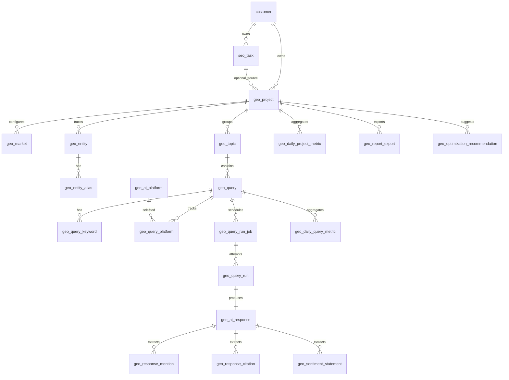

# GEO 分析資料表規劃

本文件僅作為 Phase 1 規劃用途，尚未代表已實作的 migration 或正式資料庫契約。

規劃依據：

- `20260617開會簡報.pdf` 的 Phase 1 MVP 功能與核心指標。
- `docs/geo-analysis-requirements.md` 的需求整理。
- 既有系統的 PostgreSQL 慣例：`uuid` 主鍵、`timestamptz` 時間欄位、`snake_case` 命名。

## 設計摘要

Phase 1 以既有 `customer` / `seo_task` 為客戶與 SEO 任務主資料來源，新增 GEO bounded context 資料表。GEO project 可視為 workspace / project，承載品牌、競品、Query、AI 跑題結果、解析結果、指標聚合與報告匯出。

核心資料流：

```text
customer / seo_task
→ geo_project
→ geo_entity / geo_topic / geo_query
→ geo_query_run_job
→ geo_query_run
→ geo_ai_response
→ mention / citation / sentiment
→ daily metrics
→ dashboard / report
```

## 主要關聯



## 共用資料規則

- `customer_id`：沿用既有 `customer.id`，代表客戶。
- `seo_task_id`：可選，若 GEO 分析要掛在既有 SEO 任務底下才填。
- `geo_project`：Phase 1 的 workspace / project 概念，避免直接把 GEO 設定塞到 `customer`。
- `id`：所有新增表預設使用 `uuid` primary key。
- 時間欄位：使用 `timestamptz`。
- 狀態與類型：Phase 1 先使用 `varchar`，避免過早綁死 PostgreSQL enum。
- 金額欄位：使用 `numeric(12,6)`。
- 百分比指標：使用 `numeric(9,4)`，例如 `75.2500` 表示 75.25%。
- AI provider 原始資料：使用 `jsonb` 保存不同平台的 metadata。
- 大型 raw response：Phase 1 可先放 DB；資料量膨脹後可搬到 object storage，DB 保留 `raw_response_storage_uri`。

## `geo_project`

GEO 分析專案。每個客戶可有多個 GEO project。

| 欄位 | 型態 | 必填 | 關聯 / 約束 | 說明 |
|---|---|---:|---|---|
| `id` | `uuid` | 是 | PK | GEO project ID |
| `customer_id` | `uuid` | 是 | FK → `customer.id` | 所屬客戶 |
| `seo_task_id` | `uuid` | 否 | FK → `seo_task.id` | 若掛在既有 SEO 任務底下則填 |
| `name` | `varchar(200)` | 是 |  | 專案名稱 |
| `default_region` | `varchar(16)` | 是 | default `'TW'` | 預設地區，例如 `TW`、`US` |
| `default_language` | `varchar(16)` | 是 | default `'zh-TW'` | 預設語言 |
| `status` | `varchar(32)` | 是 |  | `active`、`paused`、`archived` |
| `daily_run_budget` | `integer` | 是 | default `0` | 每日最多 query run 數；`0` 代表未設定 |
| `daily_cost_budget` | `numeric(12,6)` | 否 |  | 每日 API 預算上限 |
| `created_at` | `timestamptz` | 是 |  | 建立時間 |
| `updated_at` | `timestamptz` | 是 |  | 更新時間 |
| `archived_at` | `timestamptz` | 否 |  | 封存時間 |

建議索引：

```sql
CREATE INDEX ix_geo_project_customer_id ON geo_project (customer_id);
CREATE INDEX ix_geo_project_status ON geo_project (status);
```

## `geo_market`

專案可追蹤的市場設定，例如台灣、美國。

| 欄位 | 型態 | 必填 | 關聯 / 約束 | 說明 |
|---|---|---:|---|---|
| `id` | `uuid` | 是 | PK | 市場設定 ID |
| `project_id` | `uuid` | 是 | FK → `geo_project.id` | 所屬專案 |
| `region` | `varchar(16)` | 是 |  | `TW`、`US` |
| `language` | `varchar(16)` | 是 |  | `zh-TW`、`en-US` |
| `market_name` | `varchar(100)` | 是 |  | 顯示名稱，例如 Taiwan、United States |
| `prompt_locale_hint` | `text` | 是 | default `''` | 給 AI prompt 的地區語境 |
| `serp_gl` | `varchar(16)` | 否 |  | SERP API `gl` |
| `serp_hl` | `varchar(16)` | 否 |  | SERP API `hl` |
| `serp_location` | `varchar(200)` | 否 |  | SERP API location |
| `status` | `varchar(32)` | 是 |  | `active`、`paused` |
| `created_at` | `timestamptz` | 是 |  | 建立時間 |
| `updated_at` | `timestamptz` | 是 |  | 更新時間 |

約束：

```sql
UNIQUE (project_id, region, language)
```

## `geo_entity`

被追蹤的品牌、競品或其他實體。

| 欄位 | 型態 | 必填 | 關聯 / 約束 | 說明 |
|---|---|---:|---|---|
| `id` | `uuid` | 是 | PK | Entity ID |
| `project_id` | `uuid` | 是 | FK → `geo_project.id` | 所屬專案 |
| `entity_type` | `varchar(32)` | 是 |  | `primary_brand`、`competitor`、`other` |
| `name` | `varchar(200)` | 是 |  | 品牌或競品名稱 |
| `website_url` | `text` | 否 |  | 官方網站 |
| `description` | `text` | 是 | default `''` | 補充描述 |
| `status` | `varchar(32)` | 是 |  | `active`、`paused`、`archived` |
| `created_at` | `timestamptz` | 是 |  | 建立時間 |
| `updated_at` | `timestamptz` | 是 |  | 更新時間 |

約束：

```sql
UNIQUE (project_id, entity_type, name)
```

建議索引：

```sql
CREATE INDEX ix_geo_entity_project_type ON geo_entity (project_id, entity_type);
```

## `geo_entity_alias`

品牌或競品別名，用於 mention 偵測。

| 欄位 | 型態 | 必填 | 關聯 / 約束 | 說明 |
|---|---|---:|---|---|
| `id` | `uuid` | 是 | PK | Alias ID |
| `entity_id` | `uuid` | 是 | FK → `geo_entity.id` | 所屬 entity |
| `alias` | `varchar(200)` | 是 |  | 別名、英文名、縮寫 |
| `match_type` | `varchar(32)` | 是 | default `'exact'` | `exact`、`case_insensitive`、`contains` |
| `created_at` | `timestamptz` | 是 |  | 建立時間 |

約束：

```sql
UNIQUE (entity_id, alias)
```

## `geo_topic`

Query 分組維度。

| 欄位 | 型態 | 必填 | 關聯 / 約束 | 說明 |
|---|---|---:|---|---|
| `id` | `uuid` | 是 | PK | Topic ID |
| `project_id` | `uuid` | 是 | FK → `geo_project.id` | 所屬專案 |
| `name` | `varchar(200)` | 是 |  | Topic 名稱 |
| `description` | `text` | 是 | default `''` | 說明 |
| `status` | `varchar(32)` | 是 |  | `active`、`archived` |
| `created_at` | `timestamptz` | 是 |  | 建立時間 |
| `updated_at` | `timestamptz` | 是 |  | 更新時間 |

約束：

```sql
UNIQUE (project_id, name)
```

## `geo_query`

要定期送到 AI 平台的自然語言問題。

| 欄位 | 型態 | 必填 | 關聯 / 約束 | 說明 |
|---|---|---:|---|---|
| `id` | `uuid` | 是 | PK | Query ID |
| `project_id` | `uuid` | 是 | FK → `geo_project.id` | 所屬專案 |
| `topic_id` | `uuid` | 否 | FK → `geo_topic.id` | 所屬 Topic |
| `query_text` | `text` | 是 |  | 實際送給 AI 的問題 |
| `region` | `varchar(16)` | 是 |  | `TW`、`US` |
| `language` | `varchar(16)` | 是 |  | `zh-TW`、`en-US` |
| `intent` | `varchar(32)` | 否 |  | `navigational`、`informational`、`commercial`、`transactional` |
| `buyer_stage` | `varchar(32)` | 否 |  | B2B 場景，如 `supplier_evaluation`、`comparison`、`alternative` |
| `is_branded` | `boolean` | 是 | default `false` | 是否品牌字 query |
| `priority` | `varchar(32)` | 是 | default `'normal'` | `high`、`normal`、`low` |
| `run_frequency` | `varchar(32)` | 是 | default `'daily'` | `daily`、`weekly`、`manual` |
| `status` | `varchar(32)` | 是 |  | `active`、`paused`、`archived` |
| `metadata` | `jsonb` | 是 | default `'{}'::jsonb` | 自訂 metadata |
| `created_at` | `timestamptz` | 是 |  | 建立時間 |
| `updated_at` | `timestamptz` | 是 |  | 更新時間 |
| `archived_at` | `timestamptz` | 否 |  | 封存時間 |

建議索引：

```sql
CREATE INDEX ix_geo_query_project_status ON geo_query (project_id, status);
CREATE INDEX ix_geo_query_topic_id ON geo_query (topic_id);
CREATE INDEX ix_geo_query_region_language ON geo_query (region, language);
```

## `geo_query_keyword`

Query Research 輸入與生成 query 的關鍵字來源。

| 欄位 | 型態 | 必填 | 關聯 / 約束 | 說明 |
|---|---|---:|---|---|
| `id` | `uuid` | 是 | PK | Keyword ID |
| `query_id` | `uuid` | 是 | FK → `geo_query.id` | 所屬 Query |
| `keyword` | `varchar(200)` | 是 |  | 原始關鍵字 |
| `search_volume` | `integer` | 否 |  | Google Ads / Keyword Planner 搜尋量 |
| `region` | `varchar(16)` | 是 |  | 搜尋量地區 |
| `language` | `varchar(16)` | 是 |  | 搜尋量語言 |
| `source` | `varchar(64)` | 是 | default `'manual'` | `manual`、`google_ads`、`gsc` |
| `metadata` | `jsonb` | 是 | default `'{}'::jsonb` | 原始資料 |
| `created_at` | `timestamptz` | 是 |  | 建立時間 |

建議索引：

```sql
CREATE INDEX ix_geo_query_keyword_query_id ON geo_query_keyword (query_id);
```

## `geo_ai_platform`

可串接的 AI / SERP 平台。

| 欄位 | 型態 | 必填 | 關聯 / 約束 | 說明 |
|---|---|---:|---|---|
| `id` | `uuid` | 是 | PK | Platform ID |
| `code` | `varchar(64)` | 是 | Unique | `openai`、`gemini`、`claude`、`perplexity`、`google_aio` |
| `display_name` | `varchar(100)` | 是 |  | 顯示名稱 |
| `provider_type` | `varchar(32)` | 是 |  | `llm_api`、`serp_api` |
| `default_model` | `varchar(100)` | 否 |  | 預設模型 |
| `supports_citations` | `boolean` | 是 | default `false` | 是否支援引用 |
| `supports_grounding` | `boolean` | 是 | default `false` | 是否支援搜尋 grounding |
| `status` | `varchar(32)` | 是 |  | `active`、`paused` |
| `created_at` | `timestamptz` | 是 |  | 建立時間 |
| `updated_at` | `timestamptz` | 是 |  | 更新時間 |

## `geo_query_platform`

Query 要追蹤哪些平台。

| 欄位 | 型態 | 必填 | 關聯 / 約束 | 說明 |
|---|---|---:|---|---|
| `id` | `uuid` | 是 | PK | Query-platform ID |
| `query_id` | `uuid` | 是 | FK → `geo_query.id` | 所屬 Query |
| `platform_id` | `uuid` | 是 | FK → `geo_ai_platform.id` | 追蹤平台 |
| `model` | `varchar(100)` | 否 |  | 指定模型；空值用平台預設 |
| `status` | `varchar(32)` | 是 |  | `active`、`paused` |
| `created_at` | `timestamptz` | 是 |  | 建立時間 |
| `updated_at` | `timestamptz` | 是 |  | 更新時間 |

約束：

```sql
UNIQUE (query_id, platform_id)
```

## `geo_query_run_job`

Queue job 對應表。若使用 Cloud Tasks / Pub/Sub，這張表保存應用層 job 狀態與重試資訊。

| 欄位 | 型態 | 必填 | 關聯 / 約束 | 說明 |
|---|---|---:|---|---|
| `id` | `uuid` | 是 | PK | Job ID |
| `project_id` | `uuid` | 是 | FK → `geo_project.id` | 所屬專案 |
| `query_id` | `uuid` | 是 | FK → `geo_query.id` | 要執行的 Query |
| `platform_id` | `uuid` | 是 | FK → `geo_ai_platform.id` | 要執行的平台 |
| `job_type` | `varchar(32)` | 是 | default `'scheduled_run'` | `scheduled_run`、`manual_run`、`report_backfill` |
| `priority` | `varchar(32)` | 是 | default `'normal'` | `high`、`normal`、`low` |
| `scheduled_for` | `timestamptz` | 是 |  | 預計執行時間 |
| `status` | `varchar(32)` | 是 |  | `pending`、`running`、`succeeded`、`failed`、`delayed`、`skipped` |
| `attempt_count` | `integer` | 是 | default `0` | 已嘗試次數 |
| `max_attempts` | `integer` | 是 | default `3` | 最大重試次數 |
| `next_retry_at` | `timestamptz` | 否 |  | 下次重試時間 |
| `locked_at` | `timestamptz` | 否 |  | Worker 鎖定時間 |
| `locked_by` | `varchar(100)` | 否 |  | Worker ID |
| `last_error_code` | `varchar(100)` | 否 |  | 最後錯誤代碼 |
| `last_error_message` | `text` | 否 |  | 最後錯誤訊息 |
| `created_at` | `timestamptz` | 是 |  | 建立時間 |
| `updated_at` | `timestamptz` | 是 |  | 更新時間 |

建議索引：

```sql
CREATE INDEX ix_geo_query_run_job_pickup
ON geo_query_run_job (status, scheduled_for, priority);

CREATE INDEX ix_geo_query_run_job_query_platform
ON geo_query_run_job (query_id, platform_id);
```

## `geo_query_run`

實際一次 AI 呼叫紀錄。一次 job 可能因 retry 產生多筆 run。

| 欄位 | 型態 | 必填 | 關聯 / 約束 | 說明 |
|---|---|---:|---|---|
| `id` | `uuid` | 是 | PK | Run ID |
| `job_id` | `uuid` | 是 | FK → `geo_query_run_job.id` | 來源 job |
| `project_id` | `uuid` | 是 | FK → `geo_project.id` | 所屬專案 |
| `query_id` | `uuid` | 是 | FK → `geo_query.id` | Query |
| `platform_id` | `uuid` | 是 | FK → `geo_ai_platform.id` | 平台 |
| `model` | `varchar(100)` | 否 |  | 實際使用模型 |
| `region` | `varchar(16)` | 是 |  | 執行地區 |
| `language` | `varchar(16)` | 是 |  | 執行語言 |
| `prompt_text` | `text` | 是 |  | 實際送出的 prompt |
| `status` | `varchar(32)` | 是 |  | `running`、`succeeded`、`failed` |
| `started_at` | `timestamptz` | 是 |  | 開始時間 |
| `finished_at` | `timestamptz` | 否 |  | 結束時間 |
| `latency_ms` | `integer` | 否 |  | API 耗時 |
| `input_tokens` | `integer` | 否 |  | 輸入 token |
| `output_tokens` | `integer` | 否 |  | 輸出 token |
| `estimated_cost` | `numeric(12,6)` | 否 |  | 預估成本 |
| `error_code` | `varchar(100)` | 否 |  | 錯誤代碼 |
| `error_message` | `text` | 否 |  | 錯誤訊息 |
| `provider_request_id` | `varchar(200)` | 否 |  | Provider request ID |
| `metadata` | `jsonb` | 是 | default `'{}'::jsonb` | 執行 metadata |

建議索引：

```sql
CREATE INDEX ix_geo_query_run_query_started
ON geo_query_run (query_id, started_at DESC);

CREATE INDEX ix_geo_query_run_project_platform_started
ON geo_query_run (project_id, platform_id, started_at DESC);
```

## `geo_ai_response`

AI 原始回應與標準化回應。

| 欄位 | 型態 | 必填 | 關聯 / 約束 | 說明 |
|---|---|---:|---|---|
| `id` | `uuid` | 是 | PK | Response ID |
| `run_id` | `uuid` | 是 | FK → `geo_query_run.id`，Unique | 所屬 run |
| `response_text` | `text` | 是 |  | 標準化純文字回應 |
| `raw_response` | `jsonb` | 是 | default `'{}'::jsonb` | Provider 原始 response |
| `raw_response_storage_uri` | `text` | 否 |  | 若搬到 object storage，保存 URI |
| `citation_metadata` | `jsonb` | 是 | default `'[]'::jsonb` | Provider 原始 citation / grounding metadata |
| `created_at` | `timestamptz` | 是 |  | 建立時間 |

## `geo_response_mention`

AI 回應中的品牌 / 競品提及。

| 欄位 | 型態 | 必填 | 關聯 / 約束 | 說明 |
|---|---|---:|---|---|
| `id` | `uuid` | 是 | PK | Mention ID |
| `response_id` | `uuid` | 是 | FK → `geo_ai_response.id` | 所屬 response |
| `entity_id` | `uuid` | 是 | FK → `geo_entity.id` | 被提及品牌 / 競品 |
| `mention_count` | `integer` | 是 | default `1` | 同一回應中的提及次數 |
| `first_position` | `integer` | 否 |  | 第幾個被提到的 entity |
| `first_mention_text` | `text` | 否 |  | 首次提及附近文字 |
| `confidence` | `numeric(5,4)` | 否 |  | 解析信心分數 |
| `created_at` | `timestamptz` | 是 |  | 建立時間 |

約束：

```sql
UNIQUE (response_id, entity_id)
```

規則：

```text
核心指標計算時，同一 response 同一 entity 只算 1 次 mention。
mention_count 保留給分析，不直接當 Visibility 分母。
```

## `geo_response_citation`

AI 回應中的引用來源。

| 欄位 | 型態 | 必填 | 關聯 / 約束 | 說明 |
|---|---|---:|---|---|
| `id` | `uuid` | 是 | PK | Citation ID |
| `response_id` | `uuid` | 是 | FK → `geo_ai_response.id` | 所屬 response |
| `url` | `text` | 是 |  | 完整 URL |
| `domain` | `varchar(255)` | 是 |  | 正規化 domain |
| `title` | `text` | 否 |  | 頁面標題 |
| `snippet` | `text` | 否 |  | 引用摘要 |
| `citation_position` | `integer` | 否 |  | 引用出現順序 |
| `citation_type` | `varchar(64)` | 否 |  | `owned`、`competitor`、`other`、`unknown` |
| `owned_entity_id` | `uuid` | 否 | FK → `geo_entity.id` | 若屬於自家或競品 entity |
| `metadata` | `jsonb` | 是 | default `'{}'::jsonb` | 原始 citation metadata |
| `created_at` | `timestamptz` | 是 |  | 建立時間 |

建議索引：

```sql
CREATE INDEX ix_geo_response_citation_domain
ON geo_response_citation (domain);

CREATE INDEX ix_geo_response_citation_owned_entity
ON geo_response_citation (owned_entity_id);
```

## `geo_sentiment_statement`

AI 回應中與品牌相關的 statement 與輿情判讀。

| 欄位 | 型態 | 必填 | 關聯 / 約束 | 說明 |
|---|---|---:|---|---|
| `id` | `uuid` | 是 | PK | Statement ID |
| `response_id` | `uuid` | 是 | FK → `geo_ai_response.id` | 所屬 response |
| `entity_id` | `uuid` | 是 | FK → `geo_entity.id` | 對應品牌 / 競品 |
| `theme` | `varchar(200)` | 是 |  | 輿情主題 |
| `statement_text` | `text` | 是 |  | 具體陳述 |
| `sentiment` | `varchar(32)` | 是 |  | `positive`、`neutral`、`negative` |
| `confidence` | `numeric(5,4)` | 否 |  | 判讀信心分數 |
| `evidence_text` | `text` | 否 |  | 回應中的證據片段 |
| `created_at` | `timestamptz` | 是 |  | 建立時間 |

建議索引：

```sql
CREATE INDEX ix_geo_sentiment_entity_theme
ON geo_sentiment_statement (entity_id, theme);

CREATE INDEX ix_geo_sentiment_sentiment
ON geo_sentiment_statement (sentiment);
```

## `geo_daily_query_metric`

每日、每 Query、每平台、每地區的核心指標。

| 欄位 | 型態 | 必填 | 關聯 / 約束 | 說明 |
|---|---|---:|---|---|
| `id` | `uuid` | 是 | PK | Metric ID |
| `metric_date` | `date` | 是 |  | 指標日期 |
| `project_id` | `uuid` | 是 | FK → `geo_project.id` | 所屬專案 |
| `query_id` | `uuid` | 是 | FK → `geo_query.id` | Query |
| `platform_id` | `uuid` | 是 | FK → `geo_ai_platform.id` | 平台 |
| `region` | `varchar(16)` | 是 |  | 地區 |
| `entity_id` | `uuid` | 是 | FK → `geo_entity.id` | 指標對象 |
| `response_count` | `integer` | 是 | default `0` | 回應總數 |
| `mention_response_count` | `integer` | 是 | default `0` | 有提及 entity 的 response 數 |
| `visibility_percent` | `numeric(9,4)` | 是 | default `0` | Visibility |
| `sov_percent` | `numeric(9,4)` | 是 | default `0` | Share of Voice |
| `avg_position` | `numeric(9,4)` | 否 |  | 平均排名 |
| `citation_count` | `integer` | 是 | default `0` | 引用次數 |
| `owned_citation_count` | `integer` | 是 | default `0` | 自有引用次數 |
| `used_percent` | `numeric(9,4)` | 是 | default `0` | URL / domain 被採用率 |
| `citation_share_percent` | `numeric(9,4)` | 是 | default `0` | 引用份額 |
| `positive_count` | `integer` | 是 | default `0` | 正面 statement 數 |
| `neutral_count` | `integer` | 是 | default `0` | 中性 statement 數 |
| `negative_count` | `integer` | 是 | default `0` | 負面 statement 數 |
| `previous_visibility_delta` | `numeric(9,4)` | 否 |  | Visibility 與前期差 |
| `previous_sov_delta` | `numeric(9,4)` | 否 |  | SOV 與前期差 |
| `calculated_at` | `timestamptz` | 是 |  | 計算時間 |

約束：

```sql
UNIQUE (metric_date, query_id, platform_id, region, entity_id)
```

## `geo_daily_project_metric`

每日 project 層級彙總，用於 dashboard 首屏。

| 欄位 | 型態 | 必填 | 關聯 / 約束 | 說明 |
|---|---|---:|---|---|
| `id` | `uuid` | 是 | PK | Metric ID |
| `metric_date` | `date` | 是 |  | 指標日期 |
| `project_id` | `uuid` | 是 | FK → `geo_project.id` | 專案 |
| `entity_id` | `uuid` | 是 | FK → `geo_entity.id` | 指標對象 |
| `region` | `varchar(16)` | 否 |  | 地區；空值代表全地區 |
| `platform_id` | `uuid` | 否 | FK → `geo_ai_platform.id` | 平台；空值代表全平台 |
| `query_count` | `integer` | 是 | default `0` | Query 數 |
| `response_count` | `integer` | 是 | default `0` | Response 數 |
| `visibility_percent` | `numeric(9,4)` | 是 | default `0` | 彙總 Visibility |
| `sov_percent` | `numeric(9,4)` | 是 | default `0` | 彙總 SOV |
| `avg_position` | `numeric(9,4)` | 否 |  | 平均排名 |
| `owned_citation_share_percent` | `numeric(9,4)` | 是 | default `0` | 自有引用份額，屬延伸指標 |
| `positive_count` | `integer` | 是 | default `0` | 正面數 |
| `neutral_count` | `integer` | 是 | default `0` | 中性數 |
| `negative_count` | `integer` | 是 | default `0` | 負面數 |
| `calculated_at` | `timestamptz` | 是 |  | 計算時間 |

約束：

```sql
UNIQUE (metric_date, project_id, entity_id, region, platform_id)
```

## `geo_optimization_recommendation`

把低 visibility、負面 sentiment、競品 better performer、citation gap 轉成可執行建議。

| 欄位 | 型態 | 必填 | 關聯 / 約束 | 說明 |
|---|---|---:|---|---|
| `id` | `uuid` | 是 | PK | Recommendation ID |
| `project_id` | `uuid` | 是 | FK → `geo_project.id` | 專案 |
| `query_id` | `uuid` | 否 | FK → `geo_query.id` | 關聯 Query |
| `topic_id` | `uuid` | 否 | FK → `geo_topic.id` | 關聯 Topic |
| `entity_id` | `uuid` | 是 | FK → `geo_entity.id` | 建議對象 |
| `recommendation_type` | `varchar(64)` | 是 |  | `content_gap`、`negative_sentiment`、`citation_gap`、`competitor_win` |
| `priority` | `varchar(32)` | 是 |  | `high`、`normal`、`low` |
| `title` | `varchar(300)` | 是 |  | 建議標題 |
| `description` | `text` | 是 |  | 建議內容 |
| `evidence` | `jsonb` | 是 | default `'{}'::jsonb` | 來源指標與證據 |
| `status` | `varchar(32)` | 是 |  | `open`、`accepted`、`dismissed`、`done` |
| `created_at` | `timestamptz` | 是 |  | 建立時間 |
| `updated_at` | `timestamptz` | 是 |  | 更新時間 |

備註：若七月底 MVP 時程緊，可先不落表，改由 dashboard 即時計算建議；此表保留作為正式化建議工作流的規劃。

## `geo_report_export`

客戶報告匯出紀錄。

| 欄位 | 型態 | 必填 | 關聯 / 約束 | 說明 |
|---|---|---:|---|---|
| `id` | `uuid` | 是 | PK | Export ID |
| `project_id` | `uuid` | 是 | FK → `geo_project.id` | 專案 |
| `report_type` | `varchar(32)` | 是 |  | `pdf`、`ppt`、`csv` |
| `period_start` | `date` | 是 |  | 報告起日 |
| `period_end` | `date` | 是 |  | 報告迄日 |
| `status` | `varchar(32)` | 是 |  | `pending`、`running`、`succeeded`、`failed` |
| `file_uri` | `text` | 否 |  | Cloud Storage / 檔案位置 |
| `requested_by` | `uuid` | 否 | FK → `user_account.id` | 觸發匯出的使用者 |
| `error_message` | `text` | 否 |  | 錯誤訊息 |
| `created_at` | `timestamptz` | 是 |  | 建立時間 |
| `finished_at` | `timestamptz` | 否 |  | 完成時間 |

## `geo_api_usage_log`

每次 provider 呼叫的成本與 quota 追蹤。

| 欄位 | 型態 | 必填 | 關聯 / 約束 | 說明 |
|---|---|---:|---|---|
| `id` | `uuid` | 是 | PK | Usage ID |
| `run_id` | `uuid` | 否 | FK → `geo_query_run.id` | 對應 run |
| `project_id` | `uuid` | 是 | FK → `geo_project.id` | 專案 |
| `platform_id` | `uuid` | 是 | FK → `geo_ai_platform.id` | 平台 |
| `provider` | `varchar(64)` | 是 |  | `openai`、`google`、`anthropic`、`perplexity`、`serpapi` |
| `model` | `varchar(100)` | 否 |  | 模型 |
| `operation` | `varchar(64)` | 是 |  | `llm_response`、`web_search`、`serp_query`、`sentiment_parse` |
| `input_tokens` | `integer` | 否 |  | 輸入 token |
| `output_tokens` | `integer` | 否 |  | 輸出 token |
| `request_count` | `integer` | 是 | default `1` | 請求次數 |
| `estimated_cost` | `numeric(12,6)` | 否 |  | 預估成本 |
| `occurred_at` | `timestamptz` | 是 |  | 發生時間 |
| `metadata` | `jsonb` | 是 | default `'{}'::jsonb` | Provider metadata |

建議索引：

```sql
CREATE INDEX ix_geo_api_usage_project_occurred
ON geo_api_usage_log (project_id, occurred_at DESC);

CREATE INDEX ix_geo_api_usage_platform_occurred
ON geo_api_usage_log (platform_id, occurred_at DESC);
```

## 指標計算規則來源

以下為簡報明定指標：

| 指標 | 計算方式 |
|---|---|
| Visibility 能見度 | 提及品牌的回應數 ÷ 回應總數 × 100% |
| SOV 聲量佔比 | 我方品牌提及數 ÷ 我方品牌與所有競品提及數 |
| Position 平均排名 | 回應中品牌第幾個被提到；只計算有提到品牌的回應 |
| Mentions 品牌提及 | 提及品牌的回應數 ÷ 回應總數 |
| Used % 引用採用率 | 某 URL 被引用的回應數 ÷ 總回應數 |
| Share % 引用份額 | 某 URL 引用次數 ÷ 所有總引用次數 |

簡報另有規則：

- 每個指標都需帶與前期比較的變化值，例如 `+1.9pp`、`-0.4pp`。
- 同一回應中同一品牌多次提及只算 1 次。

以下為工程推導或延伸指標，需再由產品確認：

| 指標 | 說明 |
|---|---|
| Owned Citation Share | 根據自有引用、By URL/Domain、Type 分類需求推導 |
| `positive_count` / `neutral_count` / `negative_count` | 根據輿情分析頁需求推導 |
| 前期比較 period | 可用前一日或前一週，但需由報表週期拍板 |

## Phase 1 必要表清單

七月底 MVP 若要控範圍，最小必要表為：

```text
geo_project
geo_market
geo_entity
geo_entity_alias
geo_topic
geo_query
geo_query_keyword
geo_ai_platform
geo_query_platform
geo_query_run_job
geo_query_run
geo_ai_response
geo_response_mention
geo_response_citation
geo_sentiment_statement
geo_daily_query_metric
geo_daily_project_metric
geo_report_export
geo_api_usage_log
```

`geo_optimization_recommendation` 若優化行動建議確定列入 MVP，也應納入 Phase 1；若時間不足，可先用 dashboard rule 即時計算，不落表。

## 驗收情境

- 可建立一個 `geo_project` 並掛到既有 `customer`。
- 可建立 primary brand、competitor、alias。
- 可建立 topic 與 query，query 可設定 region、language、intent、priority、run_frequency。
- 可為 query 指定多個 AI platform。
- Scheduler 可產生 `geo_query_run_job`。
- Worker 可建立 `geo_query_run`、保存 `geo_ai_response`。
- Parser 可寫入 mention、citation、sentiment。
- Aggregator 可產出每日 query/project 指標。
- Dashboard 可用 project、query、topic、platform、region、date 查詢指標。
- 成本頁或 log 可查每個 project/platform/date 的 API 使用量。
- Report export 可保存產出狀態與檔案 URI。

## 假設與預設

- Phase 1 使用既有 `customer` 作為客戶主資料，`geo_project.customer_id` 必填。
- `seo_task_id` 先設為 nullable，避免 GEO 必須綁定既有 SEO task。
- 不使用 PostgreSQL enum，先用 `varchar`，方便 MVP 期間快速調整狀態與平台類型。
- Google AIO 視為 `serp_api` provider，不用 Gemini API 取代。
- API 回應是正式指標來源；網頁版模擬只做抽樣 QA，不進正式指標表。
- Queue 可用 Cloud Tasks 或 Pub/Sub；資料表 `geo_query_run_job` 仍保留應用層狀態，避免完全依賴雲端 queue 查詢歷史。
