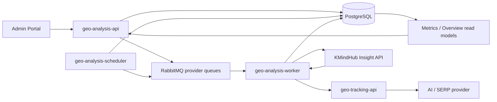

# GEO Analysis 現況、架構與 Roadmap

> 更新日期：2026-07-27
>
> 本文件是目前 GEO 功能的主要入口，用來回答「系統現在能做什麼、實際怎麼運作、有哪些限制、接下來應做什麼」。歷史需求、已完成規格與早期缺口文件已移至 [`docs/archived/geo/`](./archived/geo/README.md)。`docs/architecture/geo-tracking/` 保留為原始規劃與 ADR，不因本次整併而改寫。

## 1. 文件使用方式與 source of truth

不同問題應以不同來源為準，避免把歷史規劃誤認為現況：

| 問題 | Source of truth |
| --- | --- |
| 目前支援的 HTTP API | `apps/geo-analysis-api/.../routes.py`、[`geo-tracking-api.md`](./geo-tracking-api.md) |
| Application workflow 與公式 | `packages/younilab-seo/src/younilab_seo/geo_analysis/application/` |
| PostgreSQL schema | `deploy/local/postgresql/*.sql` 與 Postgres models；不再使用舊 schema 規劃文件判斷現況 |
| Worker、scheduler 與 runtime wiring | `apps/geo-analysis-worker/`、`apps/geo-analysis-scheduler/`、`deploy/` |
| Admin Portal 實際能力 | `apps/admin-portal/src/pages/Geo*.vue`、router、services 與 permissions |
| Semantic／KMindHub 詳細流程 | [`geo-analysis-kmindhub-report-pipeline.md`](./integrations/geo-analysis-kmindhub-report-pipeline.md) |
| 架構決策與早期規劃 | [`docs/architecture/geo-tracking/`](./architecture/geo-tracking/)；保留參考，不代表每個 phase 仍未完成 |

## 2. 目前產品邊界

GEO 目前已經不是只有同步呼叫模型的 PoC。現行主線涵蓋：

1. 建立 Project，設定市場、品牌、競品、Alias、Topic 與 Query。
2. 執行 Query Research／Generation，保存 run、draft、shortlist 與 accepted Query。
3. 立即建立 job，或由每日 scheduler 展開 active Query 的工作。
4. Worker 經 RabbitMQ 呼叫 `geo-tracking-api`，保存 raw response 與 references。
5. 成功的 run result 進入 KMindHub semantic analysis 與 deterministic citation normalization。
6. Report use cases 從已保存 facts 即時計算 metrics、前期比較與 Overview read model。
7. Admin Portal 顯示 KPI、趨勢、競品列、Topic／Query 表現、Citation、Sentiment 與 response drilldown。

目前已實作的 runner surface 是 Gemini 與 Google AIO。其他 AI Platform adapter 是獨立擴充工作，不列為本文件的主要功能缺口。

## 3. 系統架構與責任

### `geo-analysis`

擁有 Project 與 Query 設定、tenant／resource authorization、planning persistence、job orchestration、scheduler materialization、run result persistence、semantic／citation facts、metrics 公式與報表 read model。

### `geo-tracking`

擁有 Query Research、Query Generation 與 provider execution。它不擁有 Project CRUD、排程、queue job 狀態、報表公式或 GEO persistence。Query Generation 與 Runner 的邊界以 [`ADR 0001`](./architecture/geo-tracking/adr/0001-separate-query-generation-and-runner-boundaries.md) 為準。

### KMindHub

負責從 AI raw answer 萃取 entity mention、sentiment 與 semantic facts。Citation URL 不交給 KMindHub 重新生成，而是在 `geo-analysis` 依 runner references deterministic normalize。完整生命週期、verification 與 evidence repair 見 [`GEO KMindHub Semantic Analysis 與 Dashboard Report 資料流程`](./integrations/geo-analysis-kmindhub-report-pipeline.md)。

### Admin Portal

標準 GEO 使用者以 Overview、Projects、Project Edit 與 Query Research 為主；RD／管理入口另提供 Entities、Topics／Queries、Schedules、Jobs、Report Design 與 Flow Check。Navigation、route guard、頁面 GET 與 action permission 必須保持一致。

## 4. 現行 workflow

### 4.1 設定與 Query planning

- Project 已支援 tenant、customer reference、region、language、website、status 與 budget 等基本資料。
- Market、own brand、competitor、entity aliases、Topic 與 Query 都有正式 CRUD／persistence。
- Project Query Settings 已保存 research provider、run provider、keywords、market type、audience、intent、最大 Query 數與 brand mention rules。
- Query Research 與 Query Generation run 會保存 request、result、錯誤與 timestamps。
- Generated Query 先保存為 draft，可 shortlisted／rejected，接受後才建立正式 Query。

限制：Project Edit 目前能編輯基本資料、競品、aliases 與 Query，但 Query Settings 表單只出現在新增 Project 的第二步；既有 Project 的 Settings 編輯入口仍需產品與 UI 決策。

### 4.2 Job、排程與跑題

- Manual job 與 dispatch 已存在，job 會保存不可變 execution snapshot、dedupe key、attempt 與 dispatch evidence。
- 每日 scheduler 預設以 `Asia/Taipei` 03:00 為 materialization 時點。
- Scheduler 目前直接展開所有 active Project × active Query × active Platform。
- 既有 `geo_query_schedule` CRUD 是 legacy 相容資源；daily scheduler 不讀取它，scheduler-created job 的 `schedule_id` 為 `NULL`。
- Worker 依 provider queue 呼叫 tracking service，保存 raw response 與 references。
- Provider 已經回答後若 persistence 失敗，不會自動重呼 provider；reconciliation 會將結果標記為 outcome unknown，避免不受控的重複成本。

### 4.3 Semantic 與 citation pipeline

- Tracking 成功後，worker 對每個 completed run result 觸發 semantic analysis 與 citation normalization。
- Semantic analysis 需要 active own brand 與有效 KMindHub workspace mapping；失敗會保存獨立 analysis status，不會把已成功的 tracking job 改成 failed。
- Mention detection、entity position、positive／negative sentiment、theme、statement 與其他 semantic facts 都能回溯至 run result 與 evidence。
- Citation normalization 保存 normalized URL、domain、title、position、ownership 與 source type。
- 現行 source type 僅可靠區分 `owned_site` 與 `unknown`；非自有頁面的 publisher／social／marketplace 等內容分類尚未完成。

### 4.4 Metrics 與報表

目前已提供：

- Visibility、Mentions、SOV、Average Position。
- Citation Count、Used %、Share %。
- Positive／negative sentiment count。
- 等長前期比較與 delta。
- Project／Topic／Query／provider／region／language／date filters。
- Entity comparison、Citation By URL／By Domain、trend 與 response drilldown。

Dashboard 現在從 run results 與 facts 即時計算，不會在讀取時重跑 KMindHub，也尚未寫入 daily metric snapshots。

## 5. 功能狀態矩陣

| 能力 | 狀態 | 邊界或剩餘工作 |
| --- | --- | --- |
| Project／Market／Entity／Alias／Topic／Query CRUD | 已完成 | Project Edit 尚無 Query Settings 編輯入口 |
| Query Research／Generation persistence | 已完成 | 缺 Keyword Planner search volume、related keywords、Show More Prompts |
| Draft shortlist 與接受為正式 Query | 已完成 | 已是 backend persistence，不是 local-only shortlist |
| Manual job、RabbitMQ、Worker、raw result | 已完成 | 仍需營運面的 DLQ／outcome unknown 可視化 |
| Daily scheduler | 部分完成 | 固定每日展開；未套用 query frequency、branded weekly 或 legacy schedules |
| Semantic facts | 已完成主線 | 需要 reanalyze／backfill 與 coverage 顯示 |
| Citation normalization | 已完成基礎 | 缺 reference page enrichment 與完整 source taxonomy |
| Metrics、前期比較、Overview | 已完成主線 | 即時計算，尚無 snapshot persistence；semantic denominator policy 待調整 |
| 競品對標 | 部分完成 | 有 entity metrics，但缺 Better Performer、gap ranking 與原因解釋 |
| Response detail | 已完成主線 | 可再補 facts 專用明細與 data freshness |
| Provider request audit／usage／cost estimate | 已完成程式與 migration | 部署前仍須確認 migrations、pricing rows 與 PostgreSQL views |
| 優化行動建議 | 未實作 | 現有 mock recommendations 不代表正式能力 |
| 客戶 PDF／PPT 報告 | 未實作 | 需要版型、敘事、artifact lifecycle、權限與下載 API |
| Watched URLs、變化告警、Brief／內容閉環 | 未實作 | 屬後續 Phase 2／3 |

## 6. 必須先理解的資料語意

### 6.1 Semantic metrics 與分析失敗

目前 Visibility、Mentions、SOV、Position 的 run-result 母體是符合期間與 filters 的 completed run results；semantic facts 則只來自 `geo_semantic_analysis.status = completed`。因此 semantic extraction 失敗的 completed response 可能進入分母，但沒有 mention facts，對客戶看起來會像沒有品牌提及。

Citation metrics 使用完成的 citation normalization facts，與 semantic extraction 是否成功是不同的資料品質邊界。產品不得用單一「分析成功率」混合兩者。

建議正式報告補上：

- `semanticAnalysisCompletedCount`
- `semanticAnalysisFailedCount`
- `semanticCoveragePercent`
- `citationNormalizationCompletedCount`
- `citationCoveragePercent`
- 不完整資料警示與可補跑狀態

並拍板 semantic metrics 是維持「所有 completed responses」為分母，還是只採 semantic-analysis-completed samples。未拍板前不得把兩種定義混在同一張報表。

### 6.2 Citation 指標

- Citation Count：區間內 citation fact 筆數。
- Used %：包含指定 URL／domain 的 completed response 數 ÷ completed response 數。
- Share %：指定 URL／domain 的 citation fact 筆數 ÷ 全部 citation fact 筆數。
- 「被引用網頁」是 unique normalized URL 數，不是引用次數。
- Ownership 依 Project own website domain 判定，不需要抓取 reference page。
- `contentTag`、`mentionsBrand`、`mentionedCompetitors` 需要額外讀取 reference page，目前未填入。

### 6.3 Provider audit 與成本

`provider_request` 是一個 physical request 一列；retry、reference retry 與 SerpApi page-token request 都必須各自留一列，`operation_id` 只用來 grouping。Usage 無法取得時應標為 unavailable，不得為了補 usage 重呼 provider。

成本 view 是 list-price estimate，不等同實際帳單。部署 usage-aware 程式前，migration 必須按序套用，尤其先執行 `022_geo_run_result_entity_detection.sql`，再執行 `023_provider_request_usage_cost_estimate.sql`，並確認 pricing rows 與 views 存在。

## 7. 剩餘 Roadmap

### P0：讓數字可信且能恢復

1. 拍板 semantic denominator policy，加入 semantic／citation coverage 與不完整資料提示。
2. 增加 admin-only reanalyze／renormalize endpoint。
3. 建立 compensation／backfill job，處理缺少或舊版本的 semantic／citation facts。
4. 補 Flow Check 的 analysis error detail、DLQ 與 execution outcome unknown 營運檢視。
5. 建立 deployment health check，驗證 migrations、KMindHub mapping、pricing rates、queues 與 report prerequisites。

### P1：形成可行動的 GEO 產品

1. 建立 competitor gap read model：Visibility gap、SOV gap、Query-level Better Performer 與可追溯證據。
2. 建立 Recommendation domain／API，輸出原因、affected queries、evidence、內容類型、優先級與預期改善指標。
3. 對 known citation URL 做 SSRF-safe 單頁 enrichment，加入 source taxonomy、content tag、brand／competitor mention 與 cache。
4. 建立客戶可讀 PDF／PPT 報告，包含摘要、前期比較、競品、輿情、citations、機會與下期建議。

### P2：補 Query demand 與成本控制

1. 串接 Google Ads／Keyword Planner，依地區與語言保存 search volume。
2. 增加 related keywords 與 Show More Prompts，並定義與 shortlist／正式 Query 的保存關係。
3. 統一排程模型，讓 query daily／weekly／paused、branded 降頻與「下個週期跑」真正影響 materialization。
4. 將 tenant／Project budget、provider usage estimate 與是否建立 job 連動。
5. 量測報表讀取效能後，再決定 daily metric snapshot 與 materialized read model。

### P3：內容與營運閉環

- Watched URLs。
- Visibility／SOV／負面輿情變化告警。
- 文案 Brief 與核心／衛星文章建議。
- 競品內容缺口反查。
- 已優化內容成效追蹤。
- 多客戶 Agency View。
- 排程化客戶報告寄送。

## 8. 建議驗收順序

每一個新 GEO capability 應沿著實際資料鏈驗收，不只確認 UI 有畫面：

1. Contract 與 validation。
2. Migration／Postgres model／repository 與 tenant scoping。
3. Application use case 與 deterministic tests。
4. Worker／queue／external provider failure path。
5. API permission、Problem Details 與 DTO mapping。
6. Admin Portal navigation、route guard、page-load GET 與 action permission。
7. 報表公式、denominator、coverage 與前期比較。
8. 真實 PostgreSQL／provider smoke test；若未執行，必須明確標示未驗證。

## 9. 保留文件

| 文件 | 用途 |
| --- | --- |
| [`GEO Tracking API`](./geo-tracking-api.md) | Tracking service contracts 與 provider execution 說明 |
| [`KMindHub Insight API`](./integrations/kmindhub-insight-api.md) | KMindHub runtime API contract |
| [`GEO Analysis 與 KMindHub Insight Extraction`](./integrations/geo-analysis-kmindhub-insight-extraction.md) | Extraction mapping 與 legacy／current task boundary |
| [`GEO KMindHub Semantic Analysis 與 Dashboard Report 資料流程`](./integrations/geo-analysis-kmindhub-report-pipeline.md) | 現行 semantic、citation、metrics 與 debug 深入說明 |
| [`GEO architecture 與 ADR`](./architecture/geo-tracking/) | 前人規劃、module specs 與仍有效的架構決策；完整保留 |
| `apps/geo-analysis-api/README.md` | API runtime、persistence 與 endpoint 操作說明 |
| `apps/geo-analysis-scheduler/README.md` | Scheduler runtime 與環境設定 |
| `deploy/README.md` | Compose、queues、migrations 與部署操作 |

## 10. 已封存文件

封存只代表文件不再是目前 source of truth，不代表內容沒有歷史價值。封存清單與原因見 [`docs/archived/geo/README.md`](./archived/geo/README.md)。
