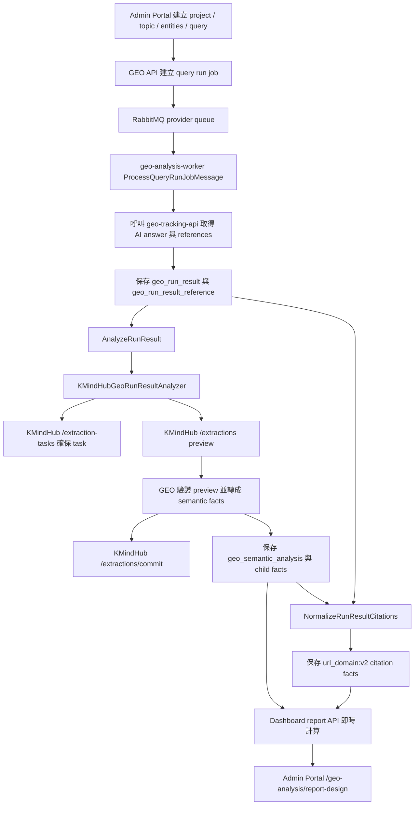

# GEO KMindHub Semantic Analysis 與 Dashboard Report 資料流程

本文整理 GEO query 從執行、呼叫 KMindHub、保存 semantic facts / citation facts，到 dashboard report API 顯示資料的完整流程。

目前正式報表主線是新版 semantic / citation pipeline。舊版 `RunKMindHubAnalysisExtraction` 與 `POST /api/geo/run-results/{resultId}/analysis-extractions` 已不再作為 dashboard 資料來源，該 legacy API 目前回傳 `410 Gone`。

## 流程總覽



## 前置資料需求

Semantic analysis 要能完成，project 內必須有以下設定：

| 類型 | 用途 |
| --- | --- |
| Project | query、entity、topic 與 report 的歸屬單位。 |
| Query | 產生 run result，並提供 query text、topic、provider、region、language 等 context。 |
| Active own brand entity | `AnalyzeRunResult` 必要條件。缺少時 semantic analysis 會保存 `failed`，`errorCode = own_brand_missing`。 |
| Active competitor entities | 非必要，但有設定才會送入 KMindHub entity context，並出現在競品比較。 |
| Own brand website URL | citation normalization 用來判斷引用來源是否為自有網站。 |
| KMindHub workspace mapping | worker 呼叫 KMindHub 前會透過 mapping 取得 workspace；沒有 mapping 時會 provision workspace。 |

## Worker 成功後的後處理

`ProcessQueryRunJobMessage` 的成功流程如下：

1. 從 queue message 取得 query job。
2. 驗證 tenant 與 provider。
3. 呼叫 tracking client 執行 query。
4. 保存 tracking response：
   - `geo_run_result`
   - `geo_run_result_reference`
5. 若整個 tracking response 成功，逐筆 run result 執行：
   - `AnalyzeRunResult`
   - `NormalizeRunResultCitations`

Semantic analysis 或 citation normalization 失敗時，worker 只記錄 exception，不會把已成功的 query job 改成 failed。這代表 query 跑成功但報表資料不完整時，需要看 run result 的 analysis / citation normalization 狀態。

## AnalyzeRunResult 做什麼

`AnalyzeRunResult` 是 application use case，負責把 DB 已保存的 run result 組成 semantic analyzer command。

### 輸入來源

| 資料 | 來源 |
| --- | --- |
| `run_result_id` | worker 從已保存 run results 逐筆傳入。 |
| `raw_response` | `geo_run_result.raw_response`。 |
| provider / surface / model / region / language | `geo_run_result`。 |
| query text / topic | `geo_query` 與 active topic。 |
| own brand / competitors | project 內 active entities。 |

### 跳過或失敗條件

| 條件 | 結果 |
| --- | --- |
| run result 不存在 | 拋出 `RunResultSemanticAnalysisNotFound`。 |
| 已有 semantic analysis 且不是 force reanalyze | 直接回傳既有結果，不重跑 KMindHub。 |
| run result 不是 `completed` 或 `raw_response` 為空 | 保存 failed analysis，`errorCode = run_result_not_analyzable`。 |
| query context 不存在 | 保存 failed analysis，`errorCode = query_context_missing`。 |
| 沒有 active own brand entity | 保存 failed analysis，`errorCode = own_brand_missing`。 |
| KMindHub analyzer 丟例外 | 保存 failed analysis，`errorCode = exception class name`，`errorMessage = str(exc)`。 |

## 送給 KMindHub 的內容

正式 analyzer 是 `KMindHubGeoRunResultAnalyzer`。它不是只把 AI answer 送給 KMindHub，而是組成一段 extraction text，包含 query metadata、topic context、entity context 與 AI answer。

概念格式如下：

```text
GEO semantic analysis input

Instructions:
- Extract facts only from the AI answer section.
- For entity mention and sentiment facts, entityId must be copied exactly from the entity context below.
- Do not invent entityId values. If an entity is not listed, do not emit an entity fact for it.
- evidenceText must be copied from the AI answer section, not from this context.

Query context:
- projectId: ...
- queryId: ...
- queryText: ...
- provider: ...
- surface: ...
- model: ...
- region: ...
- language: ...

Topic context:
- topicId: ...
- topicName: ...
- topicDescription: ...

Entity context:
- entityId: <own brand UUID>; entityRole: own_brand; entityName: ...; websiteUrl: ...
- entityId: <competitor UUID>; entityRole: competitor; entityName: ...; websiteUrl: ...

AI answer:
<geo_run_result.raw_response>
```

這段 context 的目的是讓 KMindHub 回傳 entity facts 時只能使用系統已知的 entity UUID，避免產生 `entityId must be a UUID: Acme` 這類錯誤。

Evidence validation 仍只比對 `AI answer` 原始回答文字；context 內的 entity name / website / query metadata 不會被當成 evidence。

## KMindHub task schema

Task key 是：

```text
geo_semantic_analysis
```

Schema version 是：

```text
1
```

Analyzer version 會保存為：

```text
geo_semantic_analysis:v1
```

Task 欄位如下：

| 欄位 | 用途 | 報表使用 |
| --- | --- | --- |
| `entityId` | tracked entity UUID。 | entity comparison、sentiment。 |
| `entityRole` | `own_brand` 或 `competitor`。 | entity comparison、SOV。 |
| `entityName` | entity 顯示名稱。 | entity comparison。 |
| `mentioned` | 此 entity 是否被回答提及。 | visibility、mentions、SOV。 |
| `firstMentionOrder` | 被提及 entity 的首次出現順序，從 1 開始。 | average position。 |
| `sentiment` | `positive` 或 `negative`。 | sentiment breakdown。 |
| `theme` | sentiment statement 的主題。 | 目前保存，dashboard summary 尚未直接呈現。 |
| `statement` | sentiment statement。 | sentiment facts，未來可做明細。 |
| `factType` | `product` / `service` / `topic` / `common_statement`。 | 目前保存，未來可做主題與陳述分析。 |
| `value` | semantic fact value。 | 目前保存，未來可做 topic/product/service 報表。 |
| `evidenceText` | 必須存在於 raw response 的證據文字。 | debug / explainability。 |
| `confidence` | 0 到 1 的信心分數。 | 目前保存，dashboard 尚未直接呈現。 |

## KMindHub 呼叫順序與 response

### 1. Provision 或取得 workspace

Worker 透過 `ManageKMindHubWorkspaceMapping` 取得 tenant 對應的 KMindHub workspace。

若沒有 mapping，會呼叫 KMindHub：

```http
POST /workspaces
Content-Type: application/json

{
  "displayName": "..."
}
```

GEO 端需要的 response 欄位：

```json
{
  "workspaceId": "00000000-0000-4000-8000-000000000001"
}
```

### 2. 建立或重用 extraction task

如果 `kmindhub_extraction_task_mapping` 已有 active 的 `geo_semantic_analysis` v1，就重用既有 `kmindhub_task_id`。

否則呼叫：

```http
POST /extraction-tasks
X-Workspace-Id: <workspaceId>
Content-Type: application/json

{
  "name": "GEO semantic analysis v1",
  "task": "...",
  "description": "...",
  "status": "active",
  "fields": [...]
}
```

GEO 端需要的 response 欄位：

```json
{
  "taskId": "00000000-0000-4000-8000-000000000002"
}
```

若 response 用 `id` 代替 `taskId`，目前 client 也可接受。

### 3. Preview extraction

```http
POST /extractions
X-Workspace-Id: <workspaceId>
Content-Type: application/x-www-form-urlencoded

taskId=<taskId>
text=<semantic extraction text>
```

GEO 端解析的 response 形狀：

```json
{
  "taskId": "00000000-0000-4000-8000-000000000002",
  "items": [
    {
      "fields": {
        "entityId": { "value": "..." },
        "entityRole": { "value": "own_brand" },
        "entityName": { "value": "..." },
        "mentioned": { "value": "true" },
        "firstMentionOrder": { "value": "1" },
        "evidenceText": { "value": "..." },
        "confidence": { "value": "0.9" }
      },
      "verification": {
        "passed": true
      },
      "displayFields": [],
      "candidates": []
    }
  ]
}
```

`fields` 可能回傳 mention、sentiment 或 semantic fact 所需欄位。GEO 端會依欄位組合判斷要轉成哪一種 fact。

### 4. GEO 端驗證 preview

Preview 回來後，GEO 端會先驗證，不會直接寫入報表 facts。

主要驗證規則：

| 規則 | 失敗結果 |
| --- | --- |
| `verification.passed = false` | 不 commit，analysis failed。 |
| `entityId` 必須是 UUID | 不 commit，analysis failed。 |
| `entityRole` 必須是 `own_brand` 或 `competitor` | 不 commit，analysis failed。 |
| `sentiment` 必須是 `positive` 或 `negative` | 不 commit，analysis failed。 |
| `factType` 必須是支援 enum | 不 commit，analysis failed。 |
| `firstMentionOrder` 若有值必須大於等於 1 | 不 commit，analysis failed。 |
| `mentioned = false` 時不能有 `firstMentionOrder` 或 `evidenceText` | 不 commit，analysis failed。 |
| `confidence` 若有值必須介於 0 到 1 | 不 commit，analysis failed。 |
| `evidenceText` 必須存在於 raw response | 不 commit，analysis failed。 |

### 5. Commit extraction items

只有 preview 驗證通過後才會呼叫 commit：

```http
POST /extractions/commit
X-Workspace-Id: <workspaceId>
Content-Type: application/json

{
  "taskId": "<taskId>",
  "items": [
    {
      "itemId": null,
      "fields": {
        "entityId": { "value": "..." },
        "entityRole": { "value": "own_brand" }
      }
    }
  ]
}
```

GEO 端可接受的 response 形狀包含：

```json
{
  "commitBatchId": "...",
  "items": [
    { "itemId": "..." }
  ]
}
```

或：

```json
{
  "itemIds": ["..."]
}
```

目前 dashboard 不直接使用 KMindHub commit item id；commit 主要是讓 KMindHub 端保留 extraction items，GEO 報表使用的是 preview 驗證後轉成的 semantic facts。

## GEO 如何把 KMindHub preview 存成報表資料

Preview item 會被拆成三種 application facts：

### Entity mention fact

需要欄位：

```text
entityId, entityRole, entityName, mentioned
```

會保存成：

```text
GeoEntityMentionFact
```

用途：

| Dashboard 指標 | 計算方式 |
| --- | --- |
| Visibility | 被提及的 completed run results 數 / completed run results 總數。 |
| Mentions | 有 mention 的 run results 數。 |
| SOV | own brand mentions / own brand + competitor mentions。 |
| Average Position | `firstMentionOrder` 平均值，數字越小代表越早被提到。 |

### Sentiment fact

需要欄位：

```text
entityId, entityRole, entityName, sentiment, theme, statement
```

會保存成：

```text
GeoSentimentFact
```

用途：

| Dashboard 指標 | 計算方式 |
| --- | --- |
| Sentiment statement count | positive / negative sentiment fact 筆數加總。 |

### Response semantic fact

需要欄位：

```text
factType, value
```

會保存成：

```text
GeoResponseSemanticFact
```

目前 dashboard overview 不直接呈現這組資料，但它已保存，後續可用於 product / service / topic / common statement 類報表或明細。

## Persistence 落點

Semantic analysis 會以 `task_key = geo_semantic_analysis`、`schema_version = 1` 保存。

主要 row：

| 資料 | table / row 類型 | 說明 |
| --- | --- | --- |
| Analysis status | `GeoRunResultAnalysisRow` | 保存 `status`、`analyzer`、`analyzer_version`、`error_code`、`error_message`。 |
| Entity mention facts | `GeoRunResultEntityMentionRow` | 保存 entity mention、first mention order、evidence、confidence。 |
| Sentiment facts | `GeoRunResultStatementRow` | 保存 positive / negative statement facts。 |
| Semantic facts | `GeoResponseSemanticFactRow` | 保存 product / service / topic / common statement facts。 |

如果同一 run result 與 schema version 已有 semantic analysis，再次保存時會先刪除舊 child facts，再寫入新的 child facts。

Run result list / detail 的 `analysisStatus` 也是讀 `geo_semantic_analysis`，因此 flow-check 頁面的 semantic 狀態會與新版報表主線一致。

## Citation normalization 如何進報表

Citation 不由 KMindHub 產生，而是從 tracking provider 回傳的 references 做 deterministic normalization。

來源：

```text
geo_run_result_reference.url / title / position
```

Normalizer version：

```text
url_domain:v2
```

處理規則：

1. 如果 URL 是已知 Vertex grounding redirect：
   - host 是 `vertexaisearch.cloud.google.com`
   - path 以 `/grounding-api-redirect/` 開頭
2. 使用 HTTP resolver follow redirect，取得最終 publisher URL。
3. 不讀取或保存 response body。
4. 若 resolver 失敗，fallback 到原 URL normalization。
5. 正規化 URL scheme、host、path、query，移除 fragment。
6. 用 own brand active entity 的 website domain 判斷 `ownership`：
   - domain 相同或子網域：`owned`
   - 其他：`other`
7. `sourceType`：
   - owned：`owned_site`
   - other：`unknown`

保存落點：

| 資料 | table / row 類型 |
| --- | --- |
| Normalization status | `GeoRunResultCitationNormalizationRow` |
| Citation facts | `GeoRunResultCitationRow` |

Dashboard citation URL / domain table 只讀 `url_domain:v2` 的 completed normalization。

## Dashboard report API 如何組報表

Endpoint：

```http
GET /api/geo/projects/{projectId}/reports/dashboard
```

Query parameters：

| 參數 | 必填 | 說明 |
| --- | --- | --- |
| `periodStart` | 是 | 報表統計區間開始。 |
| `periodEnd` | 是 | 報表統計區間結束。 |
| `comparisonStart` | 否 | 比較區間開始。 |
| `comparisonEnd` | 否 | 比較區間結束。 |
| `queryId` | 否 | 限制單一 query。 |
| `topicId` | 否 | 限制單一 topic。 |
| `provider` | 否 | 限制 provider，例如 `gemini`。 |
| `region` | 否 | 限制地區。 |
| `language` | 否 | 限制語言。 |

若沒有提供 comparison 區間，後端會用目前 period 的等長前一段時間作為比較區間。

Dashboard API 不會：

- 呼叫 KMindHub。
- 呼叫 geo-tracking。
- 重新跑 semantic analysis。
- 重新跑 citation normalization。
- 寫入 snapshot。

Dashboard API 只會：

1. 讀 project 範圍內 completed run results。
2. 讀同一批 run results 最新 completed `geo_semantic_analysis`。
3. 讀同一批 run results 最新 completed `url_domain:v2` citation normalization。
4. 組成 `GeoMetricFormulaSource`。
5. 用 `CalculateGeoMetricFormulas` 即時計算 metrics。
6. 組成 `GeoDashboardReport` response。

## Dashboard response 內容

Response 形狀：

```json
{
  "periodStart": "...",
  "periodEnd": "...",
  "comparisonStart": "...",
  "comparisonEnd": "...",
  "overview": [],
  "entities": [],
  "citationUrls": [],
  "citationDomains": [],
  "sentiments": []
}
```

### Overview

包含：

| metricName | 說明 |
| --- | --- |
| `visibility` | own brand 在 completed run results 中被提及的比例。 |
| `mentions` | own brand 被提及的 run results 數。 |
| `sov` | own brand 在所有 tracked entity mentions 中的佔比。 |
| `average_position` | own brand first mention order 平均值。 |

### Entities

每列對應一個 own brand 或 competitor，包含：

- `visibility`
- `mentions`
- `averagePosition`

### Citation URLs / Domains

每列對應一個 normalized URL 或 domain，包含：

- `citationCount`
- `usedPercent`
- `sharePercent`
- `ownership`
- `sourceType`

### Sentiments

目前包含：

- `positive`
- `negative`

每列統計該 sentiment 的 statement facts 數量。

## 常見狀態與 debug 方向

| 現象 | 可能原因 | 檢查方向 |
| --- | --- | --- |
| Flow-check semantic 一直 pending | run result 沒有 `geo_semantic_analysis` row，或 API 尚未讀到最新狀態。 | 查 `GeoRunResultAnalysisRow.task_key = geo_semantic_analysis`。 |
| `own_brand_missing` | project 沒有 active own brand entity。 | 到 flow-check / setup 補 own brand entity。 |
| `entityId must be a UUID` | KMindHub preview 回傳 entity name 而非 context 內 UUID。 | 看 analyzer preview warning log 的 `entity_id_preview` 與 entity context。 |
| `evidenceText must exist in raw response` | KMindHub preview 回傳的 evidenceText 不是 raw answer 中可比對到的文字。 | 查該 run result 的 raw response，並比對 preview item 的 evidenceText 是否來自 context、query、summary 或被改寫過。 |
| `KMindHubExtractionUnavailable` | workspace、task、preview 或 commit 呼叫失敗。 | 看 error message 階段與 KMindHub API logs。 |
| Report 沒 citation | citation normalization 沒完成、version 不符，或 references URL 無法 normalize。 | 查 `url_domain:v2` normalization status。 |
| Report 有 completed analysis 但 KPI 為 0 | semantic facts completed 但沒有 own brand `mentioned=true`。 | 查 entity mention facts。 |
| Citation 顯示 Vertex redirect | 舊資料仍是 `url_domain:v1`，或 resolver 未成功產生 `url_domain:v2`。 | 新 run 或 force re-normalize 產生 v2 facts。 |

## Semantic analysis 錯誤訊息索引

Semantic analysis 失敗時，`AnalyzeRunResult` 會保存一筆 `geo_semantic_analysis` row：

- `status = failed`
- `error_code = exception class name` 或 use case 自訂代碼
- `error_message = str(exc)` 或自訂訊息

因此 DB 看到：

```text
errorCode = KMindHubExtractionValidationError
errorMessage = evidenceText must exist in raw response
```

代表錯誤發生在 KMindHub preview 已回來、GEO 正在把 preview item 轉成 semantic facts 的階段。這類錯誤不是 tracking 失敗，也不是 dashboard API 失敗，而是「KMindHub 回傳內容沒有通過 GEO 報表資料規則」。

### Use case 層錯誤

| errorCode | errorMessage | 階段 | 代表意思 | 常見處理 |
| --- | --- | --- | --- | --- |
| `run_result_not_analyzable` | `run result is not completed or raw response is empty` | `AnalyzeRunResult` 前置檢查 | Run result 不是 completed，或沒有 raw response。 | 檢查 tracking response 是否成功保存 answer。 |
| `query_context_missing` | `query context is missing` | `AnalyzeRunResult` context 組裝 | Run result 對應 query 找不到。 | 檢查 run result / query 關聯與 tenant scope。 |
| `own_brand_missing` | `active own brand entity is missing` | `AnalyzeRunResult` context 組裝 | Project 沒有 active own brand entity。 | 在 flow-check 或設定頁補 own brand entity 後重跑。 |
| `RunResultSemanticAnalysisNotFound` | `run result not found` | `AnalyzeRunResult` 保存或讀取 | Tenant 看不到該 run result。 | 檢查 tenant、project、job、run result 是否一致。 |

### KMindHub 呼叫錯誤

| errorCode | errorMessage | 階段 | 代表意思 | 常見處理 |
| --- | --- | --- | --- | --- |
| `KMindHubWorkspaceProvisionUnavailable` | `KMindHub workspace provision is unavailable` | workspace provision | GEO API/worker 連得到 KMindHub，但 `/workspaces` 失敗或 response 缺 `workspaceId`。 | 查 KMindHub Insight API log、DB 連線、workspace endpoint response。 |
| `KMindHubExtractionUnavailable` | `KMindHub extraction task is unavailable` | create extraction task | `/extraction-tasks` 失敗，或 response 缺可解析的 task id。 | 查 task schema 是否被 KMindHub 接受、`X-Workspace-Id` 是否正確。 |
| `KMindHubExtractionUnavailable` | `KMindHub extraction preview is unavailable` | preview | `/extractions` HTTP 失敗，或 response JSON 形狀無法解析。 | 查 KMindHub `/extractions` log、taskId、workspace header、timeout。 |
| `KMindHubExtractionUnavailable` | `KMindHub extraction commit is unavailable: <ExceptionClass>` | commit | `/extractions/commit` HTTP 失敗，或 response JSON 無法解析。 | 查 commit request item fields、KMindHub response body 摘要、status code。 |

### Preview validation 錯誤

| errorCode | errorMessage | 階段 | 代表意思 | 常見處理 |
| --- | --- | --- | --- | --- |
| `KMindHubExtractionValidationError` | `KMindHub preview verification failed` | preview verification | KMindHub item 的 `verification.passed` 是 `false`。 | 查 warning log 的 `verification` 摘要與 `field_names`。 |
| `KMindHubExtractionValidationError` | `KMindHub preview validation failed` | Pydantic contract validation | Preview fields 可解析，但不符合 `GeoEntityMentionFact` / `GeoSentimentFact` / `GeoResponseSemanticFact` 的 contract。 | 查欄位 enum、range、nullable 規則。 |
| `KMindHubExtractionValidationError` | `<field> must be a UUID: <value>` | field conversion | `entityId` 等 UUID 欄位不是 UUID。 | 確認 preview text 有 entity context，並要求 KMindHub 只能複製 context 內 UUID。 |
| `KMindHubExtractionValidationError` | `<field> must be a boolean` | field conversion | `mentioned` 不是可接受的 boolean。 | 預期值為 `true` / `false`、`1` / `0`、`yes` / `no`。 |
| `KMindHubExtractionValidationError` | `<field> must be an integer` | field conversion | `firstMentionOrder` 不是整數。 | 應為 1-based 整數；未提及時留空。 |
| `KMindHubExtractionValidationError` | `<field> must be a number` | field conversion | `confidence` 不是數字。 | 應為 0 到 1 的 decimal。 |
| `KMindHubExtractionValidationError` | `evidenceText must exist in raw response` | evidence validation | `evidenceText` 正規化後仍無法在 raw response 找到。 | 見下一節。 |
| `ValidationError` 轉成 `KMindHubExtractionValidationError` | `KMindHub preview validation failed` | fact contract validation | enum、range 或交叉欄位規則失敗，例如 neutral sentiment、unsupported factType、mentioned=false 仍有 firstMentionOrder。 | 查 preview item fields 是否符合 task schema 與 contract。 |

## `evidenceText must exist in raw response` 的判讀

這是今天下午測試遇到的錯誤。它的意思是：KMindHub preview 回傳了某個 `evidenceText`，但 GEO 端用正規化後的字串去比對 `geo_run_result.raw_response`，找不到相同片段。

目前 GEO 的 evidence 驗證只做這件事：

1. 取 preview item 的 `evidenceText`。
2. 對 evidence 與 raw response 做 Unicode NFKC 與 whitespace normalization。
3. 確認 normalized evidence 是 normalized raw response 的 substring。
4. 如果不是，就丟 `KMindHubExtractionValidationError("evidenceText must exist in raw response")`。

### 為什麼第一次成功、第二次可能失敗

這通常不是 DB 或 dashboard 的不穩定，而是 KMindHub / LLM extraction output 每次可能略有差異。第一次 preview 可能複製了 raw answer 裡的原句，所以通過；第二次 preview 可能回傳：

- query context 裡的文字，而不是 AI answer 裡的文字。
- entity context 裡的 brand name / website，而不是 answer 內的 evidence。
- 對 answer 做了摘要或改寫，不是原文片段。
- 把多個不連續片段合併成一句。
- 加上標點、括號、編號、翻譯或同義改寫。
- 使用 citation title 或 provider metadata，而不是 raw response。
- raw response 被 provider 格式化，和 KMindHub extraction 看到的文字有細微差異。

只要 evidence 不是 raw response 的連續片段，就會失敗。

### 為什麼要擋下來

Dashboard 的 facts 需要可追溯到原始回答，避免報表指標來自 context 或模型自行補充的內容。尤其我們把 entity context 一起送給 KMindHub，如果不驗證 evidence，LLM 可能把 context 裡的 entity name 當作 answer evidence，導致：

- 回答沒有提到品牌，卻被算成 mentioned。
- sentiment statement 不是回答原文。
- common statement 或 topic 不是 AI answer 實際內容。

所以目前策略是寧可該 run result semantic analysis failed，也不要把不可追溯的 fact 算進報表。

### Debug 步驟

1. 找到 failed row：

```sql
select
  id,
  run_result_id,
  status,
  error_code,
  error_message,
  analyzer,
  analyzer_version,
  updated_at
from geo_run_result_analyses
where task_key = 'geo_semantic_analysis'
  and status = 'failed'
order by updated_at desc;
```

2. 查 raw response：

```sql
select
  id,
  query_id,
  provider,
  region,
  language,
  raw_response,
  run_at
from geo_run_results
where id = '<run_result_id>';
```

3. 查 worker / API log：

搜尋這些 log message：

```text
KMindHub semantic preview field validation failed
KMindHub semantic preview pydantic validation failed
KMindHub semantic preview verification failed
```

目前 log 會記錄：

- `run_result_id`
- `workspace_id`
- `task_id`
- `item_index`
- `field_names`
- `entity_id_preview`
- verification 摘要

基於安全考量，目前不會把完整 raw response 或完整 preview item 寫進 log。

4. 若需要精準比對 preview evidence，短期只能從 KMindHub Insight API 側查該 preview / extraction log，或在安全環境加暫時 debug log。不要把 raw answer、完整 preview body、token 或 credential 長期寫入 production log。

### 短期處理方式

| 情境 | 處理 |
| --- | --- |
| 少數 run result 失敗，但其他 run result 已 completed | 報表仍會用 completed semantic facts 計算，只是該筆 run result 不會貢獻 semantic metrics。 |
| 想讓該筆補進報表 | 需要提供 reanalyze / backfill 工具或手動重新跑 semantic analysis；目前沒有正式手動 trigger API。 |
| 多數 run result 都失敗 | 優先調整 KMindHub task instruction，要求 `evidenceText` 必須逐字複製 `AI answer` 中的連續片段。 |
| evidence 常因標點或 whitespace 差異失敗 | 可評估放寬 evidence normalization，但不能放寬到允許摘要或 context text。 |
| evidence 來自 citation title 或 source metadata | 應修改 prompt/schema，明確禁止 evidenceText 使用 citation title、URL、query context、entity context。 |

### 後續建議修正

若要降低這類偶發失敗，建議分階段做：

1. **Prompt / schema 強化**
   - 在 task field instruction 補強：`evidenceText must be a contiguous exact quote copied from AI answer. Do not summarize, translate, combine, or use context text.`
   - 在 extraction text instructions 再補一條：`If no exact evidence exists, leave evidenceText empty.`

2. **Debug 可觀測性**
   - preview validation 失敗時，log 安全截斷後的 `evidenceTextPreview`。
   - log 不超過 120 字，不包含完整 raw response。

3. **驗證策略微調**
   - 仍保留「必須來自 raw response」。
   - 可考慮允許更強的標點 normalization，但不接受語意相似或摘要 matching。

4. **Operational 工具**
   - 補 admin-only reanalyze endpoint 或 backfill command。
   - 讓 flow-check 顯示 `analysisErrorCode` / `analysisErrorMessage`，避免只看到 failed 或 pending。

## 與舊版 extraction 的差異

| 項目 | 舊版 `RunKMindHubAnalysisExtraction` | 新版 semantic pipeline |
| --- | --- | --- |
| Task key | `geo_answer_analysis` | `geo_semantic_analysis` |
| 用途 | 舊 summary / statement preprocessing | Dashboard report 主線 facts |
| Worker 自動觸發 | 已停用 | tracking success 後自動執行 |
| API 手動入口 | 已回 `410 Gone` | 目前沒有手動 trigger API |
| Dashboard 是否使用 | 否 | 是 |
| Facts | legacy summary / statement / mention | entity mention、sentiment、semantic facts |

## 後續可補強項目

- 提供內部 admin-only reanalyze / renormalize endpoint，用於舊資料 backfill 或 debug。
- 在 flow-check 顯示 semantic failed 的 `errorCode` / `errorMessage`。
- 在 report design 頁提供「資料新鮮度」提示，例如最新 run result、semantic analysis、citation normalization 時間。
- 將 semantic facts 明細頁化，讓 UIUX 可檢視 evidence text、statement、theme、confidence。
- 建立一次性 backfill job，將舊 run result 補跑 `geo_semantic_analysis` 與 `url_domain:v2`。
